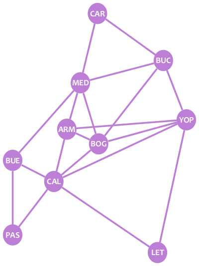

# Bienvenue!

Ce petit exercice vous donnera quelques notions de base sur la théorie des graphes: qu'est ce qu'un graphe, un nœud ou encore une arête, et comment peuvent-ils être utilisés pour modéliser l'information et résoudre des problèmes.

Vous voulez aider en apportant plus de contenu ou en corrigeant une erreur? [Retrouvez cette exercice sur Github](https://github.com/estebanadams/playground-ZJBISUmK)

# Prérequis
* Aucun.

# Graphe, nœuds et arêtes

Regardez l'image suivante:

L'image représente quelques villes colombiennes: Carthagène, Bucaramanga, Medellín, Bogota, entre autres. Chaque cercle est une ville. Les lignes reliant les cercles représentent des vols commerciaux que vous pouvez prendre entre les villes. Par exemple, vous pouvez voler de Bucaramanga (BUC) à Bogotá (BOG), car ces villes sont connectées avec une ligne, mais vous ne pouvez pas voler de Pasto (PAS) à Leticia (LET) parce qu'elles ne sont pas connectées.

Facile, non? Eh bien, c'est un graphe, et ils sont faciles à comprendre. **Les graphe** sont des structures qui nous permettent de modéliser les relations entre les éléments. Dans ce cas, nous avons utilisé un graphe pour modéliser les connexions de vol entre les villes.

Les graphes sont composés de deux types d'éléments:
1. ** Sommets ou nœuds **, qui représentent des éléments. Dans l'image, les cercles sont les noeuds, chaque noeud représentant une ville.
2. ** Arêtes **, qui représentent les relations entre les éléments. Dans l'image, les lignes sont les arêtes, chaque arête représentant une liaison aérienne entre les villes.

Chaque arête connecte exactement deux nœuds. Cela signifie que vous ne trouverez jamais une arête pointant dans le vide.

On dit que deux nœuds sont voisins si une arête les relie. Dans l'exemple, Bucaramanga (BUC) et Bogotá (BOG) sont voisins, mais Pasto (PAS) et Leticia (LET) ne le sont pas.

?[Combien de voisins le nœud BUC a-t-il?]
-[ ] 3
-[ ] 6
-[x] 4
-[ ] 5

Un graphe peut être dessiné de différentes manières tout en gardant son intégrité. Comment et où vous dessinez les nœuds et les bords d'un graphe n'a pas d'importance; ce qui compte, c'est ce que les nœuds contiennent et comment sont-ils connectés. Par exemple, notre graphe de villes peut être redessiné de la manière suivante, sans le modifier:

En partant d'un graphe, vous pouvez facilement calculer des choses sur la situation que vous modélisez. Pour les petits graphes, vous pouvez le faire à la main. Pour les graphes plus grands, vous pouvez coder des programmes simples ou utiliser des algorithmes connus pour résoudre le problème. Essayez de résoudre les questions suivantes sur le graphe des villes:

?[Combien de villes y a-t-il?]
-[x] 10
-[ ] 9
-[ ] 8
-[ ] 11

?[Si je veux voler de Carthagène (CAR) à Pasto (PAS), quel est le nombre minimum de vols que je dois prendre?]
-[x] 3
-[ ] 2
-[ ] 4
-[ ] 5

# Boucles et arêtes parallèles

Notre graphe des villes est un **graphe** simple, car il n'a pas de **"boucles"** ou **"d'arêtes parallèles"**. Voyons voir ce que c'est. Le graphe suivant est **non simple**:

Dans ce graphe, il y a une arête connectant le nœud 2 avec lui-même. Cette arête est une boucle. En d'autres termes, une **boucle** est une arête qui commence et se termine sur un même nœud. Ce nœud est connecté à lui-même, et est donc son propre voisin.

Vous pouvez également voir que les nœuds 1 et 3 sont connectés par deux arêtes. Ces arêtes sont des "arêtes parallèles" ou des "arêtes multiples". En d'autres termes, des arêtes sont dites **arêtes parallèles** si elles connectent la même paire de nœuds.

Les boucles et les arêtes parallèles sont utiles pour certaines applications spécifiques. Cependant, pour beaucoup d'applications réelles (probablement la plupart d'entre elles), vous n'avez pas à avoir de boucles ou d'arêtes parallèles dans vos graphes. Les graphes sans boucles ou arêtes parallèles sont appelés **graphes simples**.

# Le degré d'un noeud

Le **degré** d'un nœud est la quantité d'arêtes qui lui sont incidentes. Les "arêtes incidentes sur un nœud" sont des arêtes qui relient ce nœud à un autre (ou à lui-même, dans le cas d'une boucle), ou à des arêtes qui "touchent" ce nœud.

Dans un graphe simple, le degré d'un nœud est égal à la quantité de voisins qu'il a. D'un autre côté, lorsqu'un nœud a une boucle, la boucle ajoute 2 au degré du nœud.

Dans notre exemple de graphe non simple ci-dessus, les degrés des nœuds sont les suivants:
* deg(**1**) = 3
* deg(**2**) = 3 (attention: une boucle compte double)
* deg(**3**) = 2

# Graphe orienté

Supposons que nous voulions modéliser certains utilisateurs de Twitter avec un graphe. Voici les informations des utilisateurs:

- Alice (A) suit Bob et Carol.
- Bob (B) suit Alice.
- Carol (C) suit Bob.

OK cool. Nous pouvons modéliser les personnes comme des nœuds et les «follows» comme des arêtes. Cependant, cette fois nous avons besoin d'un ingrédient supplémentaire: la direction.

In Twitter, following a person goes in one direction: you may follow one person, but that person may or may not follow you back. In our example, Carol follows Bob, but Bob doesn't follow Carol back. Something similar happens with personal relationships in real life: you may like a person, but that person may or may not like you back.

Sur Twitter, suivre une personne est asymétrique: vous pouvez suivre une personne, mais cette personne peut ou pas vous suivre. Dans notre exemple, Carol suit Bob, mais Bob ne suit pas Carol. Quelque chose de similaire se produit avec les relations personnelles dans la vraie vie: vous pouvez aimer une personne, mais cette personne peut ou pas vous aimer.

C'est à cause de cette asymétrie que notre graphe a besoin d'un moyen de transmettre qui suit qui. Ceci est fait avec des **arêtes orientées (fléchées)**:

Les arêtes orientées ressemblent à des flèches. Elles ont un noeud de départ et un noeud de fin. Un graphe avec des arêtes orientées s'appelle un **graphe orienté**.

Notre graphe orienté nous montre facilement quelques informations sur nos utilisateurs. Par exemple, il est clair qu'Alice et Bob se suivent, et que Bob est la personne qui a le plus de followers (parce que deux flèches pointent vers B).
