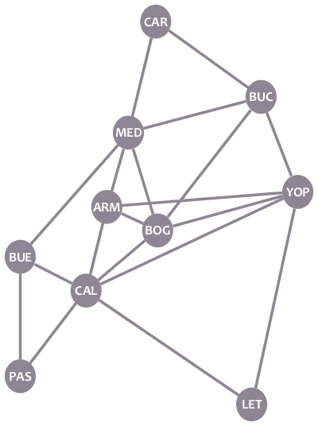
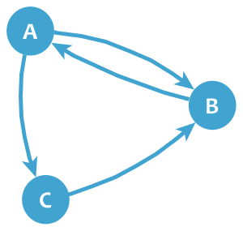

Nous savons déjà ce que sont les graphes. Maintenant, voyons comment pouvons-nous représenter les graphes d'une manière autre qu'avec un dessin. Cela sera utile si nous voulons utiliser des graphes avec un ordinateur.

# Liste d'adjacence

Vous vous rappelez de notre graphe des villes?

Faisons une liste des voisins de chaque noeud:

* **CAR:** MED, BUC
* **MED:** CAR, BUC, BUE, ARM, BOG
* **BUC:** CAR, MED, BOG, YOP
* **BUE:** MED, CAL, PAS
* **ARM:** MED, BOG, CAL
* **BOG:** MED, BUC, YOP, ARM, CAL
* **YOP:** BUC, ARM, BOG, LET
* **CAL:** BUE, ARM, BOG, YOP, LET, PAS
* **PAS:** BUE, CAL
* **LET:** CAL, YOP

C'est la **liste d'adjacence** du graphe: une liste de listes décrivant les voisins de chaque noeud.

Si le graphe est dirigé, un nœud B n'apparaît que dans la liste d'un nœud A s'il y a une arête de A à B. Par exemple, dans notre graphe Twitter dirigé:

* **A:** B, C
* **B:** A
* **C:** B

# Matrice d'adjacence d'un Graphe

Les graphes peuvent également être représentés avec des ** matrices d'adjacence **. Voici la matrice d'adjacence du graphe de nos villes:

|	|CAR	|BUC	|YOP	|BOG	|LET	|CAL	|ARM	|MED	|BUE	|PAS    |
|---	|---	|---	|---	|---	|---	|---	|---	|---	|---	|---    |
|**CAR**|0	|1	|0	|0	|0	|0	|0	|1	|0	|0      |
|**BUC**|1	|0	|1	|1	|0	|0	|0	|1	|0	|0      |
|**YOP**|0	|1	|0	|1	|1	|1	|1	|0	|0	|0      |
|**BOG**|0	|1	|1	|0	|0	|1	|1	|1	|0	|0      |
|**LET**|0	|0	|1	|0	|0	|1	|0	|0	|0	|0      |
|**CAL**|0	|0	|1	|1	|1	|0	|1	|0	|1	|1      |
|**ARM**|0	|0	|1	|1	|0	|1	|0	|1	|0	|0      |
|**MED**|1	|1	|0	|1	|0	|0	|1	|0	|1	|0      |
|**BUE**|0	|0	|0	|0	|0	|1	|0	|1	|0	|1      |
|**PAS**|0	|0	|0	|0	|0	|1	|0	|0	|1	|0      |

Les matrices d'adjacence ont les noeuds de graphe dans leurs lignes et colonnes. La valeur de chaque cellule indique s'il existe une arête entre la paire de nœuds de la ligne et de la colonne correspondantes. Par exemple, la cellule dans la ligne ** BOG ** et la colonne ** BUC ** a une valeur de ** 1 ** car il y a une arête entre BOG et BUC, alors que la cellule dans la ligne ** PAS ** et la colonne ** YOP ** a un ** 0 ** car il n'y a pas d'arête entre ces deux nœuds.

Un graphe peut avoir plusieurs matrices d'adjacence. Dans l'exemple ci-dessus, si vous placez les nœuds dans un ordre différent, vous aurez une nouvelle matrice d'adjacence du même graphe.

Comme vous pouvez le voir, si un graphe n'est pas dirigé, ses matrices d'adjacence sont symétriques. D'autre part, si le graphe est dirigé, les matrices ne sont pas symétriques, car 1 n'apparaît dans une cellule que s'il y a une arête du noeud de la rangée au noeud de la colonne. Par exemple, voici la matrice d'adjacence de notre graphe Twitter:

|   | A | B | C |
|---|---|---|---|
|**A**|0|1|1|
|**B**|1|0|0|
|**C**|0|1|0|

# Exercice

La fonction Python affichée est utilisée pour obtenir des informations sur un graphe donné. Le graphe est transmis à la fonction sous la forme d'une liste d'adjacence, et la fonction renvoie le degré maximal d'un nœud du graphe, la quantité de boucles dans le graphe et un booléen indiquant si le graphe a des arêtes parallèles ou non.

Corrigez la fonction pour qu'elle renvoie les informations souhaitées. Vous pouvez supposer que le graphe aura au plus 5 nœuds, numérotés de 1 à 5.

@[La fonction affichée doit renvoyer des informations sur un graphe donné. Corrigez la.]({"stubs": ["graphs.py"], "command": "python3 test_graphs.py"})

# Fin
Toutes nos félicitations! Vous avez maintenant quelques notions fondamentales sur la théorie des graphes. Maintenant, vous pouvez apprendre plus de concepts sur les graphes, ou commencer à apprendre quelques algorithmes utiles pour les appliquer. Le choix t'appartient!
